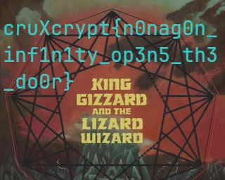

# Sierra, Sierra, Tango Victor!

## Solution

- We were given a `wav` file

- The hints from the description and title pointed it to be a `transmission` so we figured that it could be a `SSTV` transmission.

- We used [SSTV Decoder](https://github.com/colaclanth/sstv) to decode the image

```
sstv -d transmission.wav -o result.png
```



## Flag

```
cruXcrypt{nonagon_inf1n1ty_op3n5_th3_door}
```
