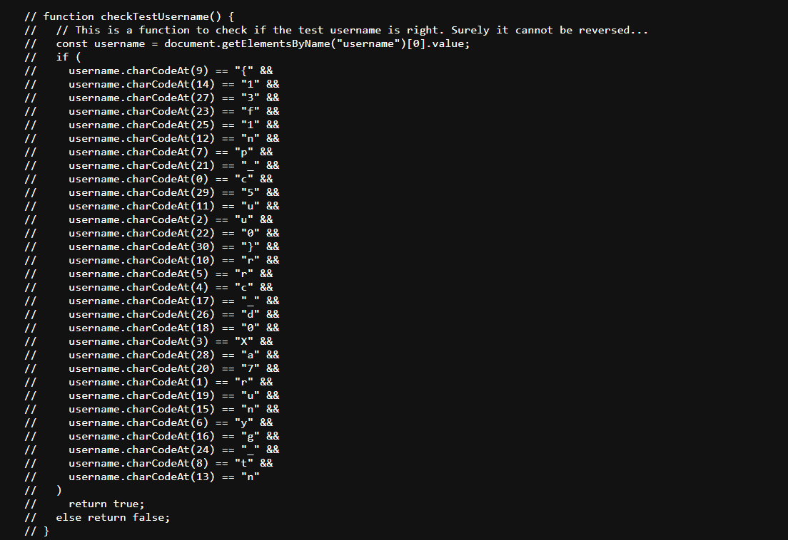

# Web F111 - Part 2

## Solution

- In the source code of the website there was a `checkTestUsername` function 

- On putting the chars from the function at the right positions we get the flag

## Flag

```
cruXcrypt{runn1ng_0u7_0f_1d3a5}
```
